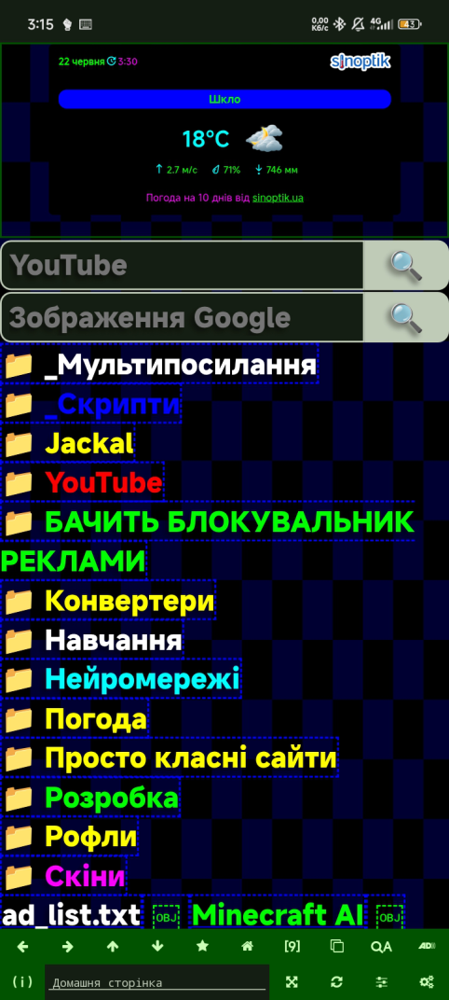
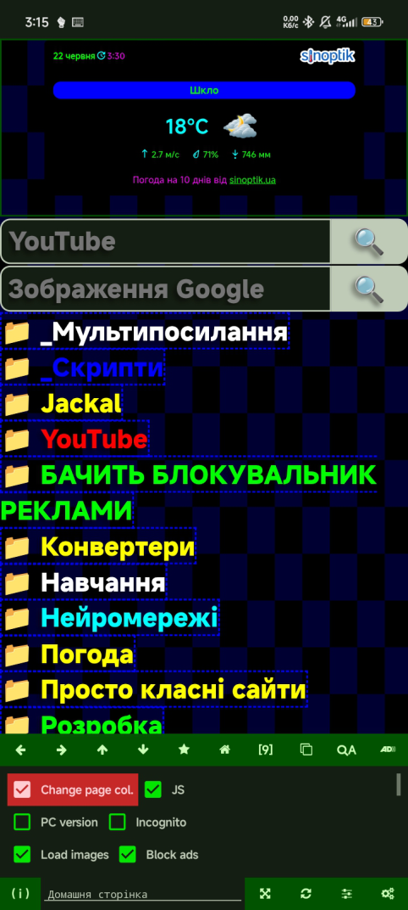
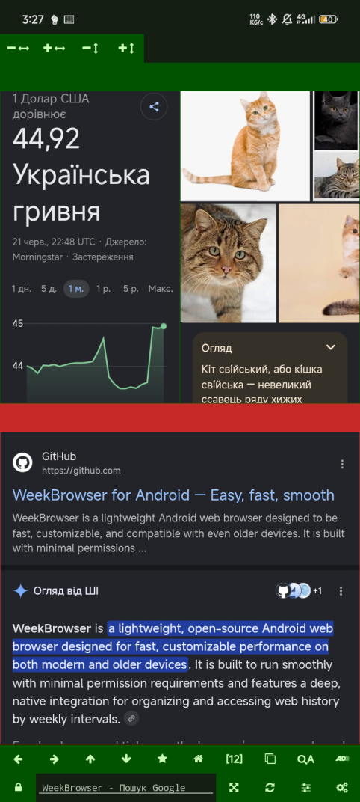
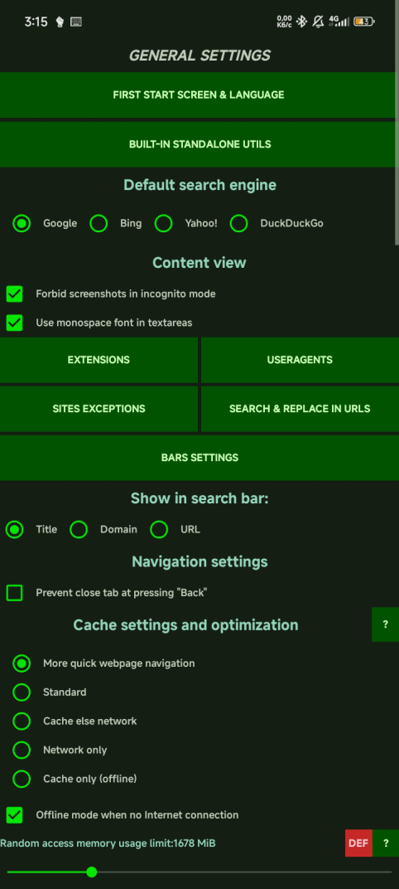
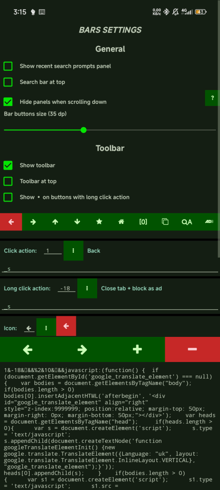
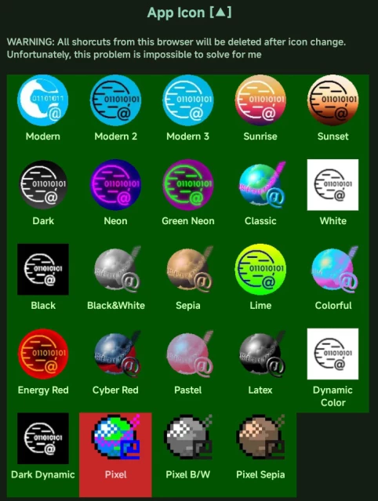
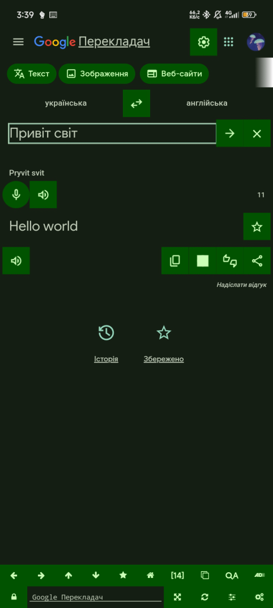

[Українська](./README-uk.md) | [Русский](./README-ru.md)

# 🪶 WeekBrowser

**WeekBrowser** is an ultra-lightweight web browser for Android. It is designed for those who demand maximum speed, total customization, and absolute respect for device resources.

It requests a bare minimum of permissions (and honestly, even if you deny them, the Universe won't collapse back into a singularity), and features a simple(?) and intuitive(???) interface, because the focus here is strictly on performance and speed. No bloated corporate nonsense.

---

## 📸 Interface Screenshots

  
  
  

---

## ✨ Features & Killer Functionality

- 🪶 **Extremely Lightweight** — The APK file weighs less than **600 KiB**, and the installed app expands to a maximum of about **1.5 MiB**. For context: the nearest "mini-competitors" start at 18 MiB.
- 🌐 **Powered by System WebView** — Uses Android's built-in engine. No heavy background rendering processes inside the app itself.
- 🕒 **Smart History** — Quick clearing in one click or via a swipe gesture on the clear button (to wipe only the latest entries). You'll thank me later for those times you forgot to turn on Incognito mode :)
- 📑 **Supercharged Home Screen** — Bookmarks are fully under your control. Create custom search fields, HTML widgets, and organize them into folders.
- 🖥️ **Windowed Mode & Multi-links** — Open multiple websites simultaneously on a single screen. Even better, you can save your entire active session into a **multi-link** (which encrypts the URLs, positions, and sizes of all windows) and share it.
- 🎯 **Unique UX (Position Manager)** — Globally save up to 3 scroll positions per website, so the browser automatically jumps right back to where you left off. Also features a 1-click export of all open tabs into a clean, text-based report.
- 🎨 **Global Skins** — This isn't just a basic forced dark mode. Websites actually adapt to your chosen browser skin (unless you explicitly add them to the exceptions list).

  
  
  
  

- 🔒 **Ruthless Anti-Flood & Ad Blocking** — Blocks banners and video ads, replacing them with invisible "pseudo-ads" (so overly sensitive websites don't block you under the guise that their developers are starving without ad revenue).
  **Don't you just hate it** when you accidentally click an ad banner in some other app, and it forces open a crappy promo site? If your device is on the slower side, I bet you'd be ready to hunt down those developers and start a riot. **Here is your solution:** WeekBrowser intercepts the link, and if it smells like an ad network, the app just quietly closes itself. A dead-simple fix that somehow nobody else thought of. Dear fellow developers, feel free to steal this idea, I'm not greedy :)
- 🧠 **Life Extender for Retro Devices** — Supports Android starting from version **5.0 (Lollipop)**. The perfect way to breathe a second life into an old, forgotten tablet.

---

## 📦 Download APK

You can grab the latest APK from official sources:
- [🚀 GitHub Releases](https://github.com/week5thor/WeekBrowser/releases)
- [📢 Telegram Channel](https://t.me/a525team)
- [💬 4PDA Forum Post](https://4pda.to/forum/index.php?showtopic=991617&view=findpost&p=131369013)

---

## 🛠 Build & Development

WeekBrowser is written in Java for Android using the Sketchware Pro environment.

To build the app yourself:
1. Clone this repository or download .swb file from Releases.
2. Open the project in Sketchware Pro (if .swb) or an Android Studio compatible environment.
3. Compile and install it on your device.

---

## 💬 Feedback & Support

Got an idea, found a bug, or discovered a hidden feature? Reach out:
- **Telegram Community**: [@a525team](https://t.me/a525team)
- **GitHub Issues**: [Submit a Bug Report / Suggestion](https://github.com/week5thor/WeekBrowser/issues)

---

## 🧾 License

This project is published under **The Unlicense** — meaning it is completely in the public domain.

You are free to use, break, rewrite, sell, or share this code without any restrictions. Long story short — do whatever you want. You downloaded the app using YOUR electricity, YOUR internet data, and spent YOUR time on it — so why shouldn't it be yours? My app on my storage, your app on yours.

See the [LICENSE](./LICENSE) file for the full text.

### Third-Party Components:
- **[Font Awesome Free](https://fontawesome.com)** — licensed under [CC BY 4.0](https://creativecommons.org/licenses/by/4.0/) and [MIT](https://opensource.org/licenses/MIT) (for icons).

*Created by an indie developer who genuinely loves fast, non-bloated software that respects your RAM.*

🌐 Official Website: [https://week5thor.github.io](https://week5thor.github.io)